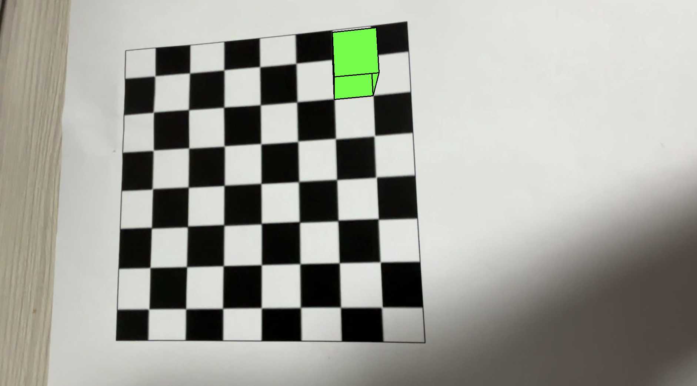

# AR 3D Cube Overlay Using OpenCV

이 프로젝트는 OpenCV의 카메라 캘리브레이션 및 AR 증강 기능을 사용하여, 체커보드(7×7 교차점)를 촬영한 영상(`video.mp4`) 위에 3D 초록색 정육면체를 오버레이하는 예제입니다. 캘리브레이션 단계에서는 체커보드의 3D-2D 대응점을 이용해 카메라의 내외부 파라미터(자세)를 추정하고, 이를 기반으로 정육면체의 3D 좌표를 영상상에 투영합니다.

## 기능

- **카메라 캘리브레이션:**  
  체커보드 영상에서 코너를 검출하고, 다수의 프레임을 이용해 카메라의 내부 행렬과 왜곡 계수를 추정합니다.

- **AR 증강:**  
  각 프레임에서 체커보드 코너를 재검출하여 `cv2.solvePnP`를 통해 카메라의 자세를 계산하고, 3D 정육면체의 꼭지점을 `cv2.projectPoints`로 영상에 투영합니다.
  
- **Depth 기반 면 그리기:**  
  정육면체의 각 면에 대해 카메라 좌표계에서의 깊이를 계산하고, 원활한 오버레이를 위해 painter’s algorithm (먼 면부터 그리기) 방식을 적용합니다.


## 설치 방법

1. Python 3가 설치되어 있는지 확인합니다.
2. 가상환경을 사용하는 경우, 가상환경을 활성화합니다.
3. 필요한 패키지를 설치합니다. 예:
   ```bash
   pip install opencv-python numpy
   ```

## 비디오 파일 준비

- `video.mp4` 파일은 체커보드(내부 코너 7×7 교차점) 영상이어야 합니다.
- 코드 내부에서 영상의 코너를 검출하며, 캘리브레이션에 필요한 프레임(예제에서는 20프레임)을 자동으로 수집합니다.

## 실행 방법

1. 프로젝트 파일(예: `ar_cube.py`)에 코드를 저장합니다.
2. 터미널이나 명령 프롬프트에서 아래와 같이 실행합니다:
   ```bash
   python ar_cube.py
   ```
3. 프로그램 실행 시, 첫 단계에서는 캘리브레이션 과정이 진행되며 캘리브레이션 프레임이 디버깅 창에 표시됩니다.
4. 캘리브레이션이 완료되면 AR 증강 기능이 활성화된 창이 나타나 3D 초록색 정육면체가 체커보드 위에 오버레이됩니다.
5. 창에서 **q** 키를 누르면 프로그램이 종료됩니다.

## 코드 구조

- **캘리브레이션 준비 및 수행:**  
  체커보드의 3D 좌표와 영상상의 2D 좌표를 추출해 `cv2.calibrateCamera` 함수를 이용해 카메라 매트릭스와 왜곡 계수를 구합니다.

- **AR 증강 처리:**  
  각 프레임마다 `cv2.solvePnP`로 체커보드의 회전 및 평행 이동 벡터를 계산한 뒤, 미리 정의된 3D 정육면체 좌표를 `cv2.projectPoints` 함수로 영상상의 2D 좌표로 투영합니다.

- **렌더링:**  
  각 면의 깊이 정보를 바탕으로 깊이가 먼 면부터 그리는 painter’s algorithm을 적용하여 3D 정육면체를 영상에 오버레이합니다.

## 커스터마이징 및 문제 해결

- **체커보드 크기 변경:**  
  체커보드의 내부 코너 수나 한 칸의 크기가 다른 경우, `objp` 생성 시 사용된 그리드 크기를 조정합니다.

- **정육면체 크기 조정:**  
  코드 내 `cube_points` 배열을 변경하여 다른 크기나 모양의 3D 객체를 생성할 수 있습니다.

- **캘리브레이션 프레임 수 변경:**  
  캘리브레이션에 사용할 프레임 수를 `calib_frame_count` 값으로 조정할 수 있습니다.

## 시연 예시

아래 이미지는 프로그램 실행 중 AR 증강 결과(3D 초록색 정육면체가 체커보드 위에 오버레이된 모습)를 캡쳐한 것입니다.

